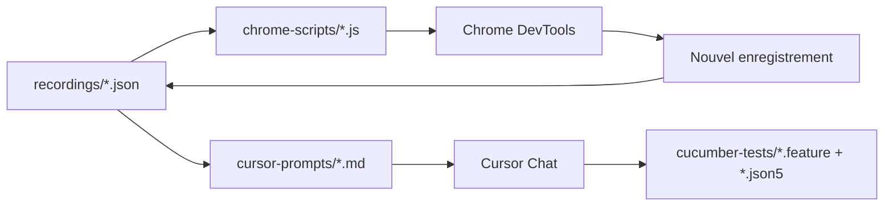
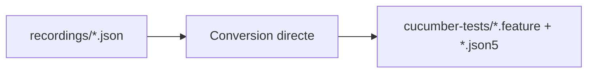

# 🏗️ Architecture Makandal - Organisation des dossiers

> **🎯 Architecture claire pour s'y retrouver facilement entre tous les types de fichiers**

## 📁 Vue d'ensemble

```
chrome-recorder-workflow/
├── recordings/          📥 JSON Chrome (INPUT)
├── chrome-scripts/      🔥 Scripts Chrome Console (OUTPUT ÉTAPE 1)
├── cursor-prompts/      🤖 Prompts IA Cursor (INTERMÉDIAIRE)  
├── cucumber-tests/      🥒 Tests Cucumber finaux (OUTPUT ÉTAPE 2)
├── configs/            ⚙️ Configurations équipe
├── bin/                🛠️ CLI et scripts
├── tools/              🔧 Outils conversion
└── docs/               📖 Documentation
```

## 🎯 Flux de données

### 🔄 Workflow complet


### ⚡ Méthode rapide (Auto)


## 📋 Rôle de chaque dossier

### 📥 recordings/ - Point d'entrée
- **Contenu** : Uniquement fichiers `.json` Chrome DevTools
- **Source** : Export Chrome Recorder 
- **Usage** : `npm run hi-makandal` ou `./bin/convert-recording.sh`
- **Organisation** : Nom descriptif (login-admin.json, search-product.json)

### 🔥 chrome-scripts/ - Scripts Chrome
- **Contenu** : Fichiers `.js` à coller dans Chrome Console
- **Source** : `npm run makandal:portal` ou `npm run makandal:dev`
- **Usage** : Copier → Chrome F12 → Console → Coller → Entrée
- **Organisation** : Auto-nommés avec timestamp

### 🤖 cursor-prompts/ - Intelligence IA  
- **Contenu** : Prompts `.md` optimisés pour Cursor Chat
- **Source** : `npm run hi-makandal` → Option 4
- **Usage** : Copier → Cursor Chat (Cmd+L) → Coller
- **Organisation** : Nom-source + contexte métier

### 🥒 cucumber-tests/ - Tests finaux
- **Contenu** : Tests `.feature` + `.json5` (éléments/URLs)
- **Source** : Conversion auto OU résultats Cursor IA
- **Usage** : Copier vers `wedia_demo` pour intégration  
- **Organisation** : **À organiser par contexte métier**

## 🗂️ Organisation recommandée cucumber-tests/

### 📚 Par domaine métier
```
cucumber-tests/
├── authentication/
│   ├── admin-login.feature
│   ├── user-signup.feature  
│   └── shared_auth_elements.json5
├── portal-management/
│   ├── create-portal.feature
│   ├── edit-portal.feature
│   └── portal_elements.json5
├── search/
│   └── product-search.feature
└── shared/
    ├── common_elements.json5
    └── common_urls.json5
```

### 🎯 Conventions nommage
- **Features** : `[action-context].feature` (create-portal.feature)
- **Éléments** : `[context]_elements.json5` (portal_elements.json5)  
- **URLs** : `[context]_urls.json5` (auth_urls.json5)
- **Partagés** : `shared_[type].json5` (shared_elements.json5)

## 🚀 Workflow recommandé équipe

### 🎯 Pour nouveau test
1. **Générer script** : `npm run makandal:portal` 
2. **Chrome** : Copier script → Console → Enregistrer scénario
3. **Exporter** : JSON → `recordings/mon-test.json`
4. **Choisir approche** :
   - **Rapide** : `./bin/convert-recording.sh mon-test.json`
   - **Premium** : `npm run hi-makandal` → Option 4 → Cursor Chat

### 📁 Organisation après génération
```bash
# Créer contexte
mkdir -p cucumber-tests/authentication/

# Déplacer fichiers générés  
mv cucumber-tests/admin-login.* cucumber-tests/authentication/

# Renommer si nécessaire
mv cucumber-tests/authentication/admin-login_elements.json5 \
   cucumber-tests/authentication/auth_elements.json5
```

### 🔄 Intégration wedia_demo
```bash
# Copier vers projet principal
cp -r cucumber-tests/authentication/ \
      ../wedia_demo/Test/e2e-tests/cucumber-app/project/features/

cp cucumber-tests/authentication/*_elements.json5 \
   ../wedia_demo/Test/e2e-tests/cucumber-app/project/definitions/
```

## 🧹 Maintenance dossiers

### 🔍 Commandes utiles
```bash
# Voir structure complète
tree chrome-recorder-workflow/

# Compter fichiers par type
find . -name "*.json" | wc -l      # Recordings
find . -name "*.js" | wc -l        # Scripts Chrome  
find . -name "*.md" | wc -l        # Prompts
find . -name "*.feature" | wc -l   # Tests Cucumber

# Nettoyer fichiers temporaires
rm chrome-scripts/chrome-recorder-*-old*.js
rm cursor-prompts/*-backup*.md
```

### 📊 Indicateurs santé
- **recordings/** : Croissance normale (nouveaux tests)
- **chrome-scripts/** : Croissance modérée (1-2 par config)
- **cursor-prompts/** : Croissance normale (1 par recording)  
- **cucumber-tests/** : Organisation par domaine requise

## 💡 Bonnes pratiques

### ✅ À faire
- **Nommer** explicitement les recordings (context-action.json)
- **Organiser** cucumber-tests/ par domaine métier
- **Réutiliser** éléments partagés (shared_elements.json5)
- **Documenter** contexte dans noms de features

### ❌ À éviter  
- **Laisser** cucumber-tests/ en vrac sans organisation
- **Dupliquer** éléments entre contextes
- **Nommer** recordings avec timestamp uniquement
- **Ignorer** la structure par domaine métier

---

**⚔️ "Une architecture claire libère l'esprit pour la créativité !" ⚔️**
