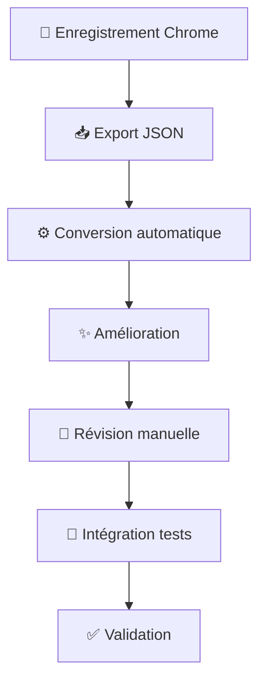

# 🎬 Chrome Recorder → Cucumber Workflow

> Workflow automatisé pour convertir les enregistrements Chrome DevTools Recorder en tests Cucumber suivant les conventions Wedia

[](./package.json)
[](./package.json)
[](./LICENSE)

## 🚀 Installation et utilisation rapide

```bash
# Installation des dépendances (si nécessaire)
npm install

# Workflow complet : Chrome JSON → Tests Cucumber
npm run workflow example-chrome-recording.json "Mon Feature"

# Conversion simple
npm run convert examples/example-chrome-recording.json

# Test de validation
npm test
```

## 📁 Structure du projet

```
chrome-recorder-workflow/
├── 📁 tools/              # Outils de conversion
│   ├── 🔧 chrome-recorder-config.js        # Configuration Chrome
│   ├── ⚙️ chrome-to-cucumber-converter.js  # Convertisseur principal
│   └── ✨ improve-generated-tests.js       # Amélioration post-génération
├── 📁 scripts/            # Scripts d'automatisation
│   └── 🚀 chrome-workflow.sh               # Workflow complet
├── 📁 examples/           # Exemples d'utilisation
│   ├── 📄 example-chrome-recording.json    # Enregistrement Chrome
│   ├── 📝 example-chrome-recording.feature # Test Cucumber généré
│   └── 🎯 *.json5                          # Définitions générées
├── 📁 docs/               # Documentation
│   └── 📖 README-Chrome-Workflow.md        # Guide détaillé
├── 📁 templates/          # Templates de base
└── 📋 package.json        # Configuration npm
```

## 🎯 Fonctionnalités

### ✅ **Conversion automatique**
- Transform les enregistrements Chrome DevTools en tests Gherkin
- Génère les définitions d'éléments et URLs automatiquement
- Suit les conventions Cucumber de votre projet

### ✅ **Optimisation des sélecteurs**
- Évite les sélecteurs dynamiques problématiques (`__BVID__`, etc.)
- Priorité aux attributs de test (`data-testid`, `portal-action`)
- Fallback intelligent sur les sélecteurs stables

### ✅ **Amélioration intelligente**
- Renommage automatique des éléments génériques
- Ajout d'assertions contextuelles
- Optimisation des steps générés

### ✅ **Workflow complet**
- Un seul script pour tout le processus
- Organisation automatique des fichiers
- Intégration avec la suite de tests existante

## 🛠️ Scripts disponibles

| Script | Description | Exemple |
|--------|-------------|---------|
| `npm run convert` | Conversion simple Chrome → Cucumber | `npm run convert mon-test.json` |
| `npm run improve` | Amélioration d'un test existant | `npm run improve test.feature` |
| `npm run workflow` | Workflow complet automatisé | `npm run workflow test.json "Feature"` |
| `npm test` | Test de validation du workflow | `npm test` |
| `npm run validate` | Validation syntax des outils | `npm run validate` |

## 📖 Documentation complète

Pour un guide détaillé d'utilisation, consultez :
👉 **[Guide complet](./docs/README-Chrome-Workflow.md)**

## 🔄 Workflow recommandé



## 📊 Exemple de conversion

### 🎬 Entrée (Chrome DevTools)
```json
{
  "type": "click",
  "selectors": [["#header_pendingdownloads_icon"]]
}
```

### 📝 Sortie (Cucumber)
```gherkin
When I click on 'notification icon'
```

```json5
{
  "notification icon": "#header_pendingdownloads_icon"
}
```

## 🏷️ Versioning

Ce projet suit le [Semantic Versioning](https://semver.org/):

- **MAJOR**: Changements incompatibles de l'API
- **MINOR**: Nouvelles fonctionnalités compatibles
- **PATCH**: Corrections de bugs

Voir [CHANGELOG.md](./CHANGELOG.md) pour l'historique des versions.

## 🤝 Contribution

1. **Fork** le projet
2. **Créez** une branche feature (`git checkout -b feature/nouvelle-fonctionnalite`)
3. **Committez** vos changements (`git commit -m 'Ajout nouvelle fonctionnalité'`)
4. **Push** la branche (`git push origin feature/nouvelle-fonctionnalite`)
5. **Ouvrez** une Pull Request

## 📄 License

Ce projet est sous licence MIT - voir le fichier [LICENSE](./LICENSE) pour plus de détails.

## 🆘 Support

- 📖 **Documentation**: [Guide complet](./docs/README-Chrome-Workflow.md)
- 🐛 **Issues**: [GitHub Issues](https://github.com/wedia-group/wedia-demo/issues)
- 💬 **Questions**: Contactez l'équipe Wedia

---

<div align="center">
  <b>Fait avec ❤️ par l'équipe Wedia</b><br>
  <sub>Automatisation des tests E2E pour une productivité maximale</sub>
</div>
