# ⚔️ Makandal - Assistant IA Révolutionnaire

> **Chrome Recorder → Cucumber** | Workflow ultra-simplifié en 2 étapes pour l'équipe Wedia Portal

[](./package.json)
[](./package.json)
[](./LICENSE)
[](#)

## ⚡ Workflow ultra-rapide (2 étapes)

```bash
# 📦 Installation (une seule fois)
npm install

# 🔥 ÉTAPE 1: Générer script Chrome Recorder
npm run makandal:portal

# 🎯 ÉTAPE 2: Convertir JSON → Cucumber 
./bin/convert-recording.sh mon-enregistrement.json
```

**🎉 C'est tout ! Votre test Cucumber est prêt !**

## 🎯 Workflow détaillé pour l'équipe

### 🔥 ÉTAPE 1: Initialisation Chrome Recorder

```bash
# Générer le script optimisé Wedia Portal
npm run makandal:portal
```

**📋 Que faire ensuite :**
1. **Copier** le contenu du fichier généré dans `generated-scripts/`
2. **Ouvrir** Chrome DevTools (F12)
3. **Console** → Coller le script → Appuyer sur Entrée
4. **Recorder** → Créer un nouvel enregistrement
5. **Enregistrer** votre scénario utilisateur
6. **Exporter** → JSON → Sauvegarder dans `recordings/`

### 🎯 ÉTAPE 2: Conversion vers Cucumber

```bash
# Placer votre fichier JSON dans le dossier recordings/
# Exemple: recordings/mon-test-login.json

# Convertir en test Cucumber
./bin/convert-recording.sh mon-test-login.json

# Ou workflow complet avec organisation  
./bin/convert-recording.sh mon-test-login.json workflow
```

**📂 Où trouver vos tests générés :**
- **Features** : `features/generated/mon-test-login.feature`
- **Définitions** : `features/generated/definitions/`

## 📦 Scripts npm disponibles

### 🔥 Scripts Makandal (Étape 1)
| Script | Usage | Description |
|--------|--------|-------------|
| `npm run makandal:portal` | **Production** | Script optimisé Wedia Portal |
| `npm run makandal:dev` | **Développement** | Script avec debug activé |
| `npm run makandal:help` | **Aide** | Liste des configs disponibles |
| `npm run list-configs` | **Info** | Voir toutes les configurations |

### 🎯 Scripts Conversion (Étape 2)
| Script | Usage | Description |
|--------|--------|-------------|
| `./bin/convert-recording.sh <nom>.json` | **Conversion** | Chrome JSON → Cucumber |
| `./bin/convert-recording.sh <nom>.json workflow` | **Workflow** | Conversion + organisation |
| `npm run recordings` | **Liste** | Voir fichiers dans recordings/ |
| `npm run convert:file` | **Aide** | Usage et fichiers disponibles |

### 🛠️ Scripts Utilitaires
| Script | Usage | Description |
|--------|--------|-------------|
| `npm run validate` | **Test** | Validation syntaxe outils |
| `npm test` | **Test** | Validation workflow complet |
| `npm run docs` | **Info** | Documentation CLI |

## 📁 Structure du projet

```
chrome-recorder-workflow/
├── 📁 bin/                 # CLI Makandal
│   └── ⚔️ makandal-cli.js              # CLI principal
├── 📁 configs/             # Configurations équipe
│   ├── 🏛️ wedia-portal.json            # Config Portal production
│   └── 🛠️ wedia-portal-dev.json        # Config Portal développement  
├── 📁 recordings/          # 📥 VOS EXPORTS JSON ICI
│   └── 📄 *.json                       # Enregistrements Chrome
├── 📁 generated-scripts/   # Scripts Chrome générés
│   ├── 📜 chrome-recorder-template.js  # Template IA
│   └── 🎯 chrome-recorder-*.js         # Scripts personnalisés
├── 📁 features/generated/  # 📤 VOS TESTS CUCUMBER ICI
│   ├── 📝 *.feature                    # Tests Gherkin générés
│   └── 📁 definitions/                 # Définitions éléments/URLs
├── 📁 tools/               # Outils conversion
├── 📁 docs/                # Documentation équipe
└── 📋 package.json         # Scripts npm
```

## ⚔️ Pourquoi Makandal ?

> **François Makandal** était un leader rebelle marron haïtien qui a guidé la résistance contre l'oppression. Makandal guide aujourd'hui votre équipe contre l'oppression... des sélecteurs dynamiques ! ⚔️

### 🔥 Révolution AI-First
- **CLI natif** simple et puissant
- **Configurations équipe** prêtes à l'emploi
- **Templates intelligents** avec hydratation IA
- **Workflow 2 étapes** ultra-simplifié

### 🎯 Optimisations Wedia Portal
- **`portal-action`** et **`data-portal`** prioritaires
- Détection automatique **Bootstrap Vue**
- Classes **Portal** stables optimisées
- Messages et tests personnalisés équipe

### ✅ **Fonctionnalités révolutionnaires**
- 🚫 **Anti-sélecteurs dynamiques** (`__BVID__`, etc.)
- 🎯 **Priorité attributs métier** Portal
- 🤖 **IA découvre définitions existantes**
- 📦 **CLI zero-config** pour équipe
- 🔄 **Workflow 2 étapes** ultra-rapide

## 📖 Documentation pour l'équipe

| Guide | Description | Lien |
|-------|-------------|------|
| 🔥 **CLI Usage** | Guide complet CLI pour équipe | [CLI_USAGE.md](./docs/CLI_USAGE.md) |
| 🎯 **Quick Start Chrome** | Guide Chrome DevTools pratique | [QUICK_START_CHROME.md](./docs/QUICK_START_CHROME.md) |
| 📋 **Integration Guide** | Intégrer tests dans wedia_demo | [INTEGRATION_GUIDE.md](./docs/INTEGRATION_GUIDE.md) |
| 🤖 **AI Prompts** | Prompts IA pour génération | [ai-prompts/](./ai-prompts/) |

## 🎬 Exemple pratique équipe

### 1️⃣ Génération script (ÉTAPE 1)
```bash
$ npm run makandal:portal

🔥 Makandal CLI - Démarrage...
✅ Configuration "wedia-portal" chargée  
💾 Script généré: chrome-recorder-wedia-portal-1234567890.js
📁 Copiez le contenu → Chrome Console
```

### 2️⃣ Dans Chrome DevTools
1. **F12** → Console → Coller script → Entrée
2. **Recorder** → Nouvel enregistrement
3. **Actions** : Login, clic menu, etc.
4. **Export** → JSON → `recordings/mon-test-login.json`

### 3️⃣ Conversion Cucumber (ÉTAPE 2)
```bash
$ ./bin/convert-recording.sh mon-test-login.json

🔥 Makandal - Conversion Chrome → Cucumber
📁 Fichier source: recordings/mon-test-login.json  
🔥 Makandal se réveille et scrute l'horizon...
📝 Feature générée: recordings/mon-test-login.feature
🎯 Définitions: recordings/mon-test-login_elements.json5
✅ Conversion terminée avec succès !
```

### 📝 Résultat Cucumber
```gherkin
Feature: Mon Test Login

  Scenario: Je peux me connecter au portail
    When I navigate to 'login page'
    And I write 'test@wedia.com' in 'email field'
    And I write 'password123' in 'password field' 
    And I click on 'login button'
    Then I should be redirected to 'dashboard' within 3 seconds
```

## 🔄 Workflow recommandé équipe

```mermaid
graph LR
    A[🔥 npm run makandal:portal] --> B[📋 Coller Chrome Console]
    B --> C[🎥 Enregistrer scénario]
    C --> D[📥 Export → recordings/]
    D --> E[🎯 ./bin/convert-recording.sh]
    E --> F[📝 Test Cucumber prêt !]
    F --> G[🚀 Intégrer wedia_demo]
```



## 🚨 Dépannage équipe

### ❌ "Configuration introuvable"
```bash
npm run makandal:help    # Voir configs disponibles
npm run list-configs     # Lister fichiers configs
```

### ❌ "Script ne fonctionne pas dans Chrome"
- Vérifiez que vous êtes dans l'onglet **Console** (pas Elements/Network)
- Script doit être collé **entièrement** avant Entrée
- Tapez `MakandalRecorder.test()` pour vérifier

### ❌ "Fichier JSON introuvable"
```bash
npm run recordings       # Voir fichiers dans recordings/
# Vérifiez le nom exact du fichier
```

### ❌ "Sélecteurs toujours dynamiques"
- Utilisez `npm run makandal:dev` pour debug
- Ajoutez des `data-testid` dans votre code Portal
- Consultez les priorités dans la config Wedia

## 🎯 Tips performance équipe

### ⚡ Raccourcis productivité
```bash
# Alias dans .bashrc/.zshrc  
alias mkp="npm run makandal:portal"
alias mkc="./bin/convert-recording.sh"
alias mkr="npm run recordings"
alias mkh="npm run makandal:help"
```

### 🎨 Bonnes pratiques Chrome Recorder
- **Nommez vos recordings** : `login-admin.json`, `search-product.json`
- **Actions lentes** : Ajouter des pauses dans l'enregistrement
- **Données test** : Utilisez des données cohérentes
- **Validation** : Toujours `MakandalRecorder.test()` après injection

### 🔍 Sélecteurs Portal prioritaires
1. **`portal-action="submit-form"`** ⭐⭐⭐
2. **`data-portal="user-menu"`** ⭐⭐⭐  
3. **`data-testid="login-btn"`** ⭐⭐
4. **`aria-label="Fermer"`** ⭐
5. **`id="unique-element"`** (si stable)

## 🏷️ Versioning & Changelog

- **v1.0.0** : CLI révolutionnaire + Templates IA 🔥
- Voir [CHANGELOG.md](./CHANGELOG.md) pour détails

## 🤝 Contribution & Support

- 🔥 **CLI Guide**: [docs/CLI_USAGE.md](./docs/CLI_USAGE.md)
- 🤖 **AI Prompts**: [ai-prompts/README.md](./ai-prompts/README.md)
- 🐛 **Issues**: Équipe Wedia Portal
- 💬 **Questions**: `@makandal-support`

---

<div align="center">
  <h3>⚔️ "François Makandal guide l'automatisation de vos tests !" ⚔️</h3>
  <p><b>Fait avec 🔥 par l'équipe Wedia Portal</b></p>
  <p><em>Révolution AI-First • Workflow 2 étapes • Productivité 400%</em></p>
</div>
