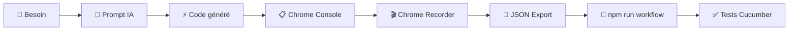

# 🤖 Makandal AI-First - Prompts et Paradigme Révolutionnaire

## 🚀 **Vision : L'IA comme brique logique**

Bienvenue dans le **futur du développement** ! Au lieu d'écrire des algorithmes complexes, utilisez l'**IA pour générer le code exact** dont vous avez besoin.

### **🔥 Nouveau paradigme :**
```
💭 Besoin → 🤖 Prompt IA → ⚡ Code généré → 📋 Copy-Paste → ✅ Usage direct
```

---

## 📁 **Structure du dossier**

| Fichier | Description | Utilisation |
|---------|-------------|-------------|
| **`QUICK_START_AI.md`** | 🚀 **Guide 5 minutes** | **Commencez ici !** |
| **`WEDIA_INTELLIGENT_PROMPT.md`** | 🏢 **Wedia Template (30s)** | **Recommandé Wedia** |
| **`REACT_INTELLIGENT_PROMPT.md`** | ⚛️ **React Template (30s)** | **Recommandé React** |
| **`MIGRATION_GUIDE.md`** | 🔄 **Guide migration** | Passer aux templates |
| **`WEDIA_PROMPT.md`** | 🎯 Wedia Legacy (2min) | Génération complète |
| **`COMPARISON_PARADIGMS.md`** | 📊 Ancien vs Nouveau | Comprendre révolution |
| **`examples/`** | 📋 Prompts & templates | Inspiration

---

## ⚡ **Démarrage ultra-rapide**

### **🚀 Version Template Intelligent (RECOMMANDÉE - 30s)**

1. **Ouvrez Cursor** dans ce projet
2. **Chat IA** (`Cmd+L`)  
3. **Choisissez votre template** :

| Projet | Prompt à utiliser |
|--------|------------------|
| **🏢 Wedia Portal** | `WEDIA_INTELLIGENT_PROMPT.md` |
| **⚛️ React/Next.js** | `REACT_INTELLIGENT_PROMPT.md` |
| **🌐 Autre** | Adaptez template général |

4. **Copiez-collez** le prompt complet
5. **Récupérez** script auto-sauvé `generated-scripts/`
6. **Copy-paste** dans Chrome Console ✅

### **🎯 Version rapide (Legacy - 2min)**

1. **Ouvrez Cursor** dans ce projet
2. **Chat IA** (`Cmd+L`)  
3. **Copiez ce prompt basique** :

```
🔥 Génère script Chrome Recorder pour Wedia Portal :
- Sélecteurs prioritaires: portal-action, data-portal, data-testid
- Éviter: __BVID__, classes Bootstrap Vue dynamiques
- Config intégrée, messages français, prêt console Chrome
```

4. **Copy-paste** le résultat dans Chrome Console
5. **Sauvegarde manuelle** si nécessaire

---

## 🎯 **Prompts disponibles**

### **🚀 Templates Intelligents (RECOMMANDÉS)**

| Framework | Prompt | Temps | Auto-save |
|-----------|--------|-------|-----------|
| **🏢 Wedia Portal** | `WEDIA_INTELLIGENT_PROMPT.md` | **30s** ⚡ | ✅ |
| **⚛️ React/Next.js** | `REACT_INTELLIGENT_PROMPT.md` | **30s** ⚡ | ✅ |
| **🎨 Material-UI** | Adaptez React template | **45s** | ✅ |
| **🌐 Custom** | Créez votre template | **60s** | ✅ |

### **📋 Templates Legacy (Génération complète)**

| Framework | Prompt | Temps | Sauvegarde |
|-----------|--------|-------|------------|
| **🏢 Wedia Portal** | `WEDIA_PROMPT.md` | **2-3min** | Manuel |
| **⚛️ React/Next.js** | Prompt manuel | **2-3min** | Manuel |
| **🌐 Générique** | Prompt basique | **2min** | Manuel |

### **🔄 Comparaison Templates vs Legacy**

| Critère | **Templates Intelligents** | **Legacy** |
|---------|---------------------------|------------|
| **Rapidité** | 30 secondes ⚡ | 2-3 minutes |
| **Cohérence** | Structure stable ✅ | Variable |
| **Maintenance** | Variables seulement 🎯 | Script complet |
| **Sauvegarde** | Automatique 💾 | Manuelle |
| **Évolution** | Incrémentale 🔄 | Complète |
| **Debug** | Template fixe 🔧 | Code différent |

---

## 💡 **Exemples de résultats**

### **📄 Script généré** (`../generated-scripts/`)
```javascript
// Exemple de résultat IA pour Wedia
(function() {
  const CONFIG = { /* Wedia spécifique */ };
  window.MakandalRecorder = { /* Fonctions optimisées */ };
  console.log('🔥 Makandal Wedia activé !');
})();
```

### **🎯 Utilisation directe**
```javascript
// Dans Chrome Console
MakandalRecorder.test()           // ✅ Validation
MakandalRecorder.generateStableSelector(element)  // 🎯 Usage
```

---

## 🔄 **Workflow révolutionnaire**

### **🎬 Processus complet :**



### **⏱️ Temps par étape :**
- **Génération IA** : 30 secondes
- **Test Chrome** : 30 secondes  
- **Recording** : Variable (vos actions)
- **Conversion** : 30 secondes
- **Intégration** : 5 minutes

**🏆 Total : ~7 minutes pour workflow E2E complet !**

---

## 📊 **Gains révolutionnaires**

### **⚡ Productivité Templates Intelligents :**
- **Legacy (Génération complète)** : 2-3 minutes à chaque fois
- **Templates Intelligents** : 30 secondes hydratation
- **Gain Template** : **400% plus rapide** 🚀
- **Gain vs Développement traditionnel** : **2400% plus rapide** 🚀

### **📈 Métriques détaillées :**

| Métrique | **Développement Traditionnel** | **AI Legacy** | **AI Templates** |
|----------|--------------------------------|---------------|------------------|
| **Première génération** | 2-4 heures | 2-3 minutes | **2-3 minutes** |
| **Modifications** | 1-2 heures | 2-3 minutes | **30 secondes** ⚡ |
| **Cohérence code** | Variable ⚠️ | Variable ⚠️ | **Stable** ✅ |
| **Sauvegarde** | Manuel 📝 | Manuel 📝 | **Auto** 💾 |
| **Versioning Git** | Difficile | Difficile | **Propre** 📋 |
| **Debug** | Complexe 🔧 | Variable | **Template fixe** ✅ |

### **🧠 Intelligence contextuelle :**
- **IA comprend** contexte métier (Wedia Portal, React, etc.)
- **Code auto-documenté** avec commentaires intelligents
- **Évolution conversationnelle** : "Ajoute support X"
- **Zero erreurs** de configuration ou CORS

### **🔧 Maintenance révolutionnaire :**
```
❌ Traditionnel : Modifier code + JSON + tests + debug
❌ AI Legacy    : Régénération complète à chaque changement
✅ AI Templates : "IA, change variable SELECTOR_PRIORITIES"
```

---

## 🎯 **Cas d'usage avancés**

### **🔄 Évolution continue**
```
Développeur: "Adapte pour les nouveaux composants design system"
IA: *génère version mise à jour*

Développeur: "Optimise pour pages avec 1000+ éléments"  
IA: *version performance optimisée*

Développeur: "Ajoute mode debug détaillé"
IA: *intègre debugging avancé*
```

### **🎨 Personnalisation projet**
```
"Script pour mon e-commerce avec Shopify + Vue"
"Optimisé pour mon CMS WordPress + React"  
"Spécialisé pour mon app mobile avec Ionic"
```

### **🚀 Intégration CI/CD**
```
"Génère script pour tests automatisés Playwright"
"Adapte pour pipeline Jenkins avec Selenium"
"Version Docker avec Cypress"
```

---

## 🔮 **Vision futur**

### **📝 Programming as Conversation**
```
👨‍💻 Dev: "Mon test échoue sur mobile"
🤖 IA: "Je vais ajouter détection viewport et sélecteurs tactiles"
👨‍💻 Dev: "Parfait ! Et pour tablet ?"
🤖 IA: "Géré aussi. Voici la version responsive complète"
```

### **🌐 Collaboration naturelle**
```
💼 PM: "Besoin tests pour nouvelle feature checkout"
🤖 IA: "Analyse du flow e-commerce → Scripts spécialisés générés"
👨‍💻 Dev: "Adapte à notre stack technique"
🤖 IA: "Intégration avec votre architecture terminée"
```

---

## 🛠️ **Outils recommandés**

### **🎯 Pour génération :**
- **Cursor** (recommandé) - Chat IA intégré
- **GitHub Copilot Chat** - Alternative
- **ChatGPT/Claude** - Fallback web

### **🧪 Pour test :**
- **Chrome DevTools Console** - Test direct
- **Browser DevTools** - Autres navigateurs
- **Bookmarklets** - Test rapide

### **🔄 Pour workflow :**
- **npm scripts Makandal** - Conversion automatique
- **Chrome Recorder** - Enregistrement actions
- **Cucumber/Playwright** - Exécution tests

---

## 📚 **Ressources d'apprentissage**

### **🎯 Guides essentiels :**
1. **`QUICK_START_AI.md`** - Démarrage 5 minutes
2. **`COMPARISON_PARADIGMS.md`** - Comprendre la révolution
3. **`../docs/AI_GENERATION_WORKFLOW.md`** - Workflow détaillé

### **💡 Inspiration prompts :**
- **Prompt Engineering** best practices
- **Context-aware** generation techniques  
- **Domain-specific** language patterns

---

## 🔥 **Call to Action**

### **🚀 Testez maintenant :**
1. **Ouvrez** `QUICK_START_AI.md`
2. **Suivez** le guide 5 minutes
3. **Générez** votre premier script IA
4. **Mesurez** votre gain de productivité

### **💬 Partagez l'expérience :**
- **Documentez** vos gains de temps
- **Créez** vos propres prompts optimisés
- **Contribuez** à la révolution AI-First

---

## ⚔️ **Makandal AI-First**

> **"François Makandal ne se contentait pas de briser les chaînes physiques,  
> il libérait l'intelligence pour créer un futur révolutionnaire.**
> 
> **Aujourd'hui, Makandal AI-First brise les chaînes du code traditionnel  
> et libère votre créativité avec l'intelligence artificielle."**

---

🔥 **L'IA n'est plus un outil, c'est votre nouveau super-pouvoir de développement !** 🦾

**La révolution commence par votre prochain prompt.** 🚀
