# 🤖 Makandal AI-First - Prompts et Paradigme Révolutionnaire

## 🚀 **Vision : L'IA comme brique logique**

Bienvenue dans le **futur du développement** ! Au lieu d'écrire des algorithmes complexes, utilisez l'**IA pour générer le code exact** dont vous avez besoin.

### **🔥 Nouveau paradigme :**
```
💭 Besoin → 🤖 Prompt IA → ⚡ Code généré → 📋 Copy-Paste → ✅ Usage direct
```

---

## 📁 **Structure du dossier**

| Fichier | Description | Utilisation |
|---------|-------------|-------------|
| **`QUICK_START_AI.md`** | 🚀 **Guide 5 minutes** | **Commencez ici !** |
| **`WEDIA_PROMPT.md`** | 🎯 Prompt spécialisé Wedia | Copier dans Cursor Chat |
| **`COMPARISON_PARADIGMS.md`** | 📊 Ancien vs Nouveau | Comprendre la révolution |
| **`examples/`** | 📋 Prompts prêts à l'emploi | Inspiration et templates |

---

## ⚡ **Démarrage ultra-rapide**

### **🎯 En 30 secondes :**

1. **Ouvrez Cursor** dans ce projet
2. **Chat IA** (`Cmd+L`)  
3. **Copiez ce prompt** :

```
🔥 Génère script Chrome Recorder pour Wedia Portal :
- Sélecteurs prioritaires: portal-action, data-portal, data-testid
- Éviter: __BVID__, classes Bootstrap Vue dynamiques
- Config intégrée, messages français, prêt console Chrome
```

4. **Copy-paste** le résultat dans Chrome Console
5. **C'est fini !** ✅

---

## 🎯 **Prompts disponibles**

### **🏢 Pour Wedia Portal**
```bash
cat WEDIA_PROMPT.md  # Prompt complet optimisé Wedia
```

### **⚛️ Pour React/Next.js**
```
Génère script Chrome Recorder pour React/Next.js :
- CSS-in-JS: css-*, sc-*, emotion-*
- CSS Modules, TypeScript compatible
- Sélecteurs: data-testid, data-cy, aria-*
```

### **🌐 Générique universel**
```
Script Chrome Recorder universel :
- Sélecteurs basiques: data-testid, aria-label, id
- Compatible tous frameworks
- Configuration minimale efficace
```

### **🎨 Material-UI spécialisé**
```
Chrome Recorder pour Material-UI :
- Composants MUI: Mui-*, makeStyles-*
- Thème dark/light, TypeScript ready
```

---

## 💡 **Exemples de résultats**

### **📄 Script généré** (`../generated-scripts/`)
```javascript
// Exemple de résultat IA pour Wedia
(function() {
  const CONFIG = { /* Wedia spécifique */ };
  window.MakandalRecorder = { /* Fonctions optimisées */ };
  console.log('🔥 Makandal Wedia activé !');
})();
```

### **🎯 Utilisation directe**
```javascript
// Dans Chrome Console
MakandalRecorder.test()           // ✅ Validation
MakandalRecorder.generateStableSelector(element)  // 🎯 Usage
```

---

## 🔄 **Workflow révolutionnaire**

### **🎬 Processus complet :**

```mermaid
graph LR
    A[💭 Besoin] --> B[🤖 Prompt IA]
    B --> C[⚡ Code généré]
    C --> D[📋 Chrome Console]
    D --> E[🎬 Chrome Recorder]
    E --> F[📄 JSON Export]
    F --> G[🔄 npm run workflow]
    G --> H[✅ Tests Cucumber]
```



### **⏱️ Temps par étape :**
- **Génération IA** : 30 secondes
- **Test Chrome** : 30 secondes  
- **Recording** : Variable (vos actions)
- **Conversion** : 30 secondes
- **Intégration** : 5 minutes

**🏆 Total : ~7 minutes pour workflow E2E complet !**

---

## 📊 **Gains révolutionnaires**

### **⚡ Productivité :**
- **Avant** : 2-4 heures développement + maintenance
- **Maintenant** : 5 minutes + évolution conversationnelle
- **Gain** : **2400% plus rapide** 🚀

### **🧠 Intelligence :**
- IA comprend le contexte métier
- Code auto-documenté et optimisé
- Évolution par conversation naturelle
- Zero erreurs de configuration

### **🔧 Maintenance :**
```
❌ Ancien : Modifier code + JSON + tests + debug
✅ Nouveau : "IA, ajoute support Material-UI"
```

---

## 🎯 **Cas d'usage avancés**

### **🔄 Évolution continue**
```
Développeur: "Adapte pour les nouveaux composants design system"
IA: *génère version mise à jour*

Développeur: "Optimise pour pages avec 1000+ éléments"  
IA: *version performance optimisée*

Développeur: "Ajoute mode debug détaillé"
IA: *intègre debugging avancé*
```

### **🎨 Personnalisation projet**
```
"Script pour mon e-commerce avec Shopify + Vue"
"Optimisé pour mon CMS WordPress + React"  
"Spécialisé pour mon app mobile avec Ionic"
```

### **🚀 Intégration CI/CD**
```
"Génère script pour tests automatisés Playwright"
"Adapte pour pipeline Jenkins avec Selenium"
"Version Docker avec Cypress"
```

---

## 🔮 **Vision futur**

### **📝 Programming as Conversation**
```
👨‍💻 Dev: "Mon test échoue sur mobile"
🤖 IA: "Je vais ajouter détection viewport et sélecteurs tactiles"
👨‍💻 Dev: "Parfait ! Et pour tablet ?"
🤖 IA: "Géré aussi. Voici la version responsive complète"
```

### **🌐 Collaboration naturelle**
```
💼 PM: "Besoin tests pour nouvelle feature checkout"
🤖 IA: "Analyse du flow e-commerce → Scripts spécialisés générés"
👨‍💻 Dev: "Adapte à notre stack technique"
🤖 IA: "Intégration avec votre architecture terminée"
```

---

## 🛠️ **Outils recommandés**

### **🎯 Pour génération :**
- **Cursor** (recommandé) - Chat IA intégré
- **GitHub Copilot Chat** - Alternative
- **ChatGPT/Claude** - Fallback web

### **🧪 Pour test :**
- **Chrome DevTools Console** - Test direct
- **Browser DevTools** - Autres navigateurs
- **Bookmarklets** - Test rapide

### **🔄 Pour workflow :**
- **npm scripts Makandal** - Conversion automatique
- **Chrome Recorder** - Enregistrement actions
- **Cucumber/Playwright** - Exécution tests

---

## 📚 **Ressources d'apprentissage**

### **🎯 Guides essentiels :**
1. **`QUICK_START_AI.md`** - Démarrage 5 minutes
2. **`COMPARISON_PARADIGMS.md`** - Comprendre la révolution
3. **`../docs/AI_GENERATION_WORKFLOW.md`** - Workflow détaillé

### **💡 Inspiration prompts :**
- **Prompt Engineering** best practices
- **Context-aware** generation techniques  
- **Domain-specific** language patterns

---

## 🔥 **Call to Action**

### **🚀 Testez maintenant :**
1. **Ouvrez** `QUICK_START_AI.md`
2. **Suivez** le guide 5 minutes
3. **Générez** votre premier script IA
4. **Mesurez** votre gain de productivité

### **💬 Partagez l'expérience :**
- **Documentez** vos gains de temps
- **Créez** vos propres prompts optimisés
- **Contribuez** à la révolution AI-First

---

## ⚔️ **Makandal AI-First**

> **"François Makandal ne se contentait pas de briser les chaînes physiques,  
> il libérait l'intelligence pour créer un futur révolutionnaire.**
> 
> **Aujourd'hui, Makandal AI-First brise les chaînes du code traditionnel  
> et libère votre créativité avec l'intelligence artificielle."**

---

🔥 **L'IA n'est plus un outil, c'est votre nouveau super-pouvoir de développement !** 🦾

**La révolution commence par votre prochain prompt.** 🚀
