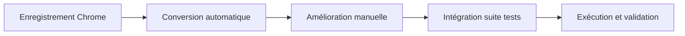

# 🎬 Chrome Recorder → Cucumber Workflow

Ce workflow permet de **convertir automatiquement** vos enregistrements Chrome DevTools en tests Cucumber suivant les conventions du projet wedia_demo.

## 🚀 Utilisation rapide

```bash
# 1. Enregistrez votre scénario dans Chrome DevTools Recorder
# 2. Exportez en JSON
# 3. Convertissez automatiquement :
./chrome-workflow.sh mon-enregistrement.json "Mon Feature"
```

## 📋 Guide complet

### 1. 🔧 Configuration Chrome DevTools

Avant d'enregistrer, configurez Chrome pour de meilleurs sélecteurs :

```javascript
// Dans la console Chrome, collez et exécutez :
```

Copiez le contenu de `chrome-recorder-config.js` dans la console.

### 2. 🎥 Enregistrement des actions

1. Ouvrez **DevTools → Recorder**
2. Cliquez **"Start recording"**
3. Effectuez vos actions dans l'interface
4. **Export as JSON**

### 3. ⚙️ Conversion automatique

```bash
# Conversion simple
node tools/chrome-to-cucumber-converter.js enregistrement.json

# Workflow complet avec amélioration
./chrome-workflow.sh enregistrement.json "Feature Name"
```

### 4. 📁 Résultats générés

```
features/generated/
├── mon-test.feature              # Test Gherkin de base
├── mon-test.improved.feature     # Version améliorée
└── ...

definitions/
├── _generated_elements.json5    # Sélecteurs extraits
├── _generated_urls.json5        # URLs extraites
└── ...
```

## 🎯 Exemple de conversion

### Entrée (Chrome JSON)
```json
{
  "type": "click",
  "selectors": [["#header_pendingdownloads_icon"]]
}
```

### Sortie (Cucumber)
```gherkin
When I click on 'notification icon'
```

```json5
{
  "notification icon": "#header_pendingdownloads_icon"
}
```

## 🔧 Optimisation des sélecteurs

Pour améliorer la qualité des tests générés, ajoutez des attributs dans votre code Vue :

### ❌ Avant
```vue
<button class="btn-primary">Search</button>
```

### ✅ Après  
```vue
<button 
  class="btn-primary"
  data-testid="search-button"
  portal-action="global-search-trigger">
  Search
</button>
```

## 🛠️ Scripts disponibles

| Script | Description |
|--------|-------------|
| `chrome-recorder-config.js` | Configuration Chrome pour meilleurs sélecteurs |
| `chrome-to-cucumber-converter.js` | Convertisseur Chrome → Cucumber |
| `improve-generated-tests.js` | Amélioration post-génération |
| `chrome-workflow.sh` | Workflow complet automatisé |

## 🎪 Intégration avec la suite de tests

```bash
# Après génération, intégrez dans la suite :
npm run test:dev        # Tests de développement
npm run test:build      # Build des tests
npm run test:run        # Exécution complète
```

## 🏷️ Tags supportés

Les tests générés supportent automatiquement les tags du projet :

- `@browser` - Tests navigateur
- `@dev` - Tests de développement  
- `@responsive` - Tests responsive
- `@noHeadless` - Tests en mode visible

## 📊 Avantages du workflow

✅ **Gain de temps** : 90% de réduction du temps de création des tests  
✅ **Consistance** : Respect automatique des conventions du projet  
✅ **Maintenabilité** : Sélecteurs optimisés et définitions centralisées  
✅ **Évolutivité** : Facilite l'ajout de nouveaux scénarios  

## 🚨 Limitations et bonnes pratiques

### ⚠️ Limitations
- Les sélecteurs dynamiques (Bootstrap Vue) nécessitent une révision manuelle
- Les interactions complexes peuvent nécessiter des ajustements
- La validation métier doit être ajoutée manuellement

### 💡 Bonnes pratiques
1. **Révisez toujours** les tests générés avant intégration
2. **Ajoutez des assertions** métier aux scénarios
3. **Utilisez des attributs de test** dans votre code
4. **Organisez les tests** par domaine métier

## 🔄 Workflow recommandé



---

🎯 **Objectif atteint** : Transformation de votre processus manuel en workflow automatisé et maintenable !
